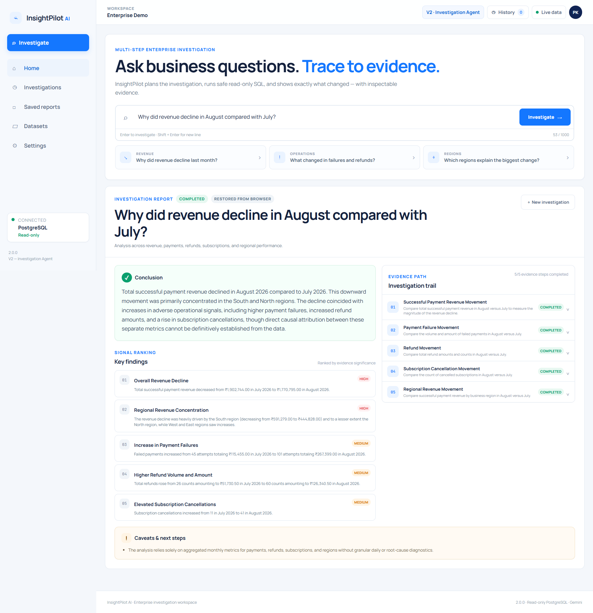
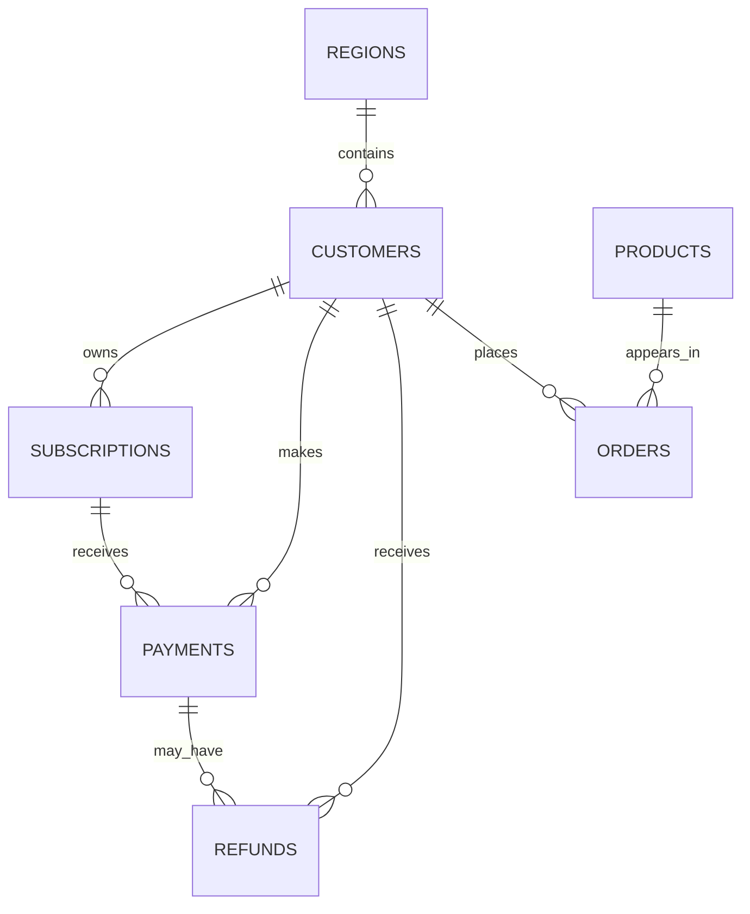

<div align="center">

# InsightPilot AI

### Enterprise Data Investigation & Analytics Agent

**Ask a business question. Let the agent investigate the data, collect evidence, and return a grounded conclusion.**

[](#project-status)
[](#project-status)
[](https://www.python.org/)
[](https://fastapi.tiangolo.com/)
[](https://www.postgresql.org/)
[](https://ai.google.dev/)
[](#testing)

</div>

---

## Overview

**InsightPilot AI** is an enterprise-style data investigation agent that answers business questions using evidence collected from a PostgreSQL database.

Instead of allowing an LLM to directly access the database or invent an explanation, InsightPilot places the model inside a controlled investigation workflow.

The system can:

- understand a business question,
- create a multi-step investigation plan,
- identify the relevant business data for each step,
- generate PostgreSQL,
- validate the generated SQL,
- execute only approved read-only queries,
- collect evidence from multiple analyses,
- rank the strongest findings,
- and synthesize a final evidence-backed conclusion.

The core engineering principle is simple:

> **The model may reason about the data, but it must never invent the data.**

---

# V2 — Investigation Agent

V1 established the foundation for safe natural-language analytics.

V2 extends that foundation into **multi-step business investigations**.

### V1

```text
Business Question
       ↓
Relevant Schema
       ↓
Generate SQL
       ↓
Validate SQL
       ↓
PostgreSQL
       ↓
Grounded Answer
```

V1 was designed for questions such as:

```text
What was our total revenue in August?
```

A single query can answer that.

---

### V2

V2 handles broader questions where one SQL query is not enough.

For example:

```text
Why did revenue decline in August compared with July?
```

Knowing that revenue declined only explains **what happened**.

To investigate **why**, InsightPilot creates multiple evidence-gathering steps.

```text
Business Question
       ↓
Investigation Planner
       ↓
┌────────────────────────────────────┐
│ Step 1 → Revenue movement          │
│ Step 2 → Payment failures          │
│ Step 3 → Refund movement           │
│ Step 4 → Subscription cancellations│
│ Step 5 → Regional revenue movement │
└────────────────────────────────────┘
       ↓
Safe SQL Generation
       ↓
SQL Validation
       ↓
Read-only PostgreSQL
       ↓
Executed Evidence
       ↓
Evidence Synthesizer
       ↓
Conclusion
+ Ranked Findings
+ Caveats
```

The investigation plan is not a predetermined answer.

Each step gathers independent evidence, and the final conclusion is created **only after the database queries have executed**.

---

# Product Interface



The screenshot above demonstrates the complete V2 workflow.

A user asks:

```text
Why did revenue decline in August compared with July?
```

InsightPilot then creates an investigation containing multiple evidence steps.

The completed report contains four important sections.

### Conclusion

The system combines the completed investigation evidence and generates a concise overall explanation.

The conclusion must remain grounded in the executed database results.

### Key Findings

Important signals are extracted from the investigation and ranked by significance.

Examples include:

- overall revenue movement,
- regional revenue concentration,
- payment failure changes,
- refund movement,
- subscription cancellation movement.

### Investigation Trail

The investigation trail shows how InsightPilot reached the final conclusion.

Each step can contain:

```text
Investigation objective
Relevant tables
Generated SQL
Executed rows
Evidence summary
Execution status
```

This makes the agent's reasoning process inspectable rather than hiding everything behind a single generated response.

### Caveats & Next Steps

InsightPilot explicitly separates **evidence from causality**.

For example, an increase in failed payments occurring alongside a revenue decline does not automatically prove that every failed payment caused lost revenue.

The system therefore uses cautious evidence-backed language instead of overstating what the data proves.

---

# How an Investigation Works

When a user submits a business question, the V2 pipeline performs the following process.

### 1. Investigation Planning

Gemini receives the business question together with approved business domains.

It generates a structured plan containing between **2 and 6 evidence-gathering steps**.

The planner:

- cannot execute SQL,
- cannot invent tables,
- cannot produce a final conclusion,
- cannot reference unapproved business domains.

---

### 2. Relevant Schema Selection

Each investigation step receives only the schema context required for that step.

The complete database schema is not blindly sent to the model.

This reduces prompt noise and limits the SQL generation context.

---

### 3. SQL Generation

Gemini generates PostgreSQL for the current evidence objective.

For example:

```text
Compare successful payment revenue in July and August.
```

The model generates SQL only for that investigation step.

---

### 4. SQL Safety Validation

Generated SQL is treated as **untrusted input**.

Before execution, InsightPilot validates it against the same safety layer introduced in V1.

Only approved read-only query shapes are allowed.

---

### 5. Read-only Execution

Validated SQL executes against PostgreSQL using a restricted database role.

The LLM never receives direct database access.

---

### 6. Evidence Collection

The executed query result becomes evidence for that investigation step.

InsightPilot stores:

```text
SQL
Referenced tables
Returned rows
Row count
Evidence summary
Step status
```

If one investigation step fails, the remaining steps can continue.

The system can therefore return a **partial investigation** instead of pretending the entire investigation succeeded.

---

### 7. Evidence Synthesis

Only successfully executed evidence is sent to the final synthesis stage.

The synthesizer produces:

```text
Conclusion
Ranked findings
Significance levels
Caveats
```

Failed or blocked steps are treated as missing evidence and are surfaced as caveats.

They are never treated as successful evidence.

---

# Safety by Design

InsightPilot deliberately separates **LLM reasoning** from **database authority**.

Gemini can propose SQL.

It cannot decide whether that SQL is safe to execute.

### Application-level controls

The SQL safety layer:

- accepts read-only `SELECT` / `WITH` queries,
- blocks write operations,
- blocks DDL,
- blocks administrative operations,
- blocks transaction-changing statements,
- restricts queries to approved application tables,
- rejects unapproved schemas,
- blocks selected unsafe PostgreSQL functions,
- limits result size to **500 rows**,
- validates SQL before PostgreSQL receives it.

### Database-level controls

The application connects using:

```text
insightpilot_readonly
```

The PostgreSQL role is configured with:

```text
SELECT-only access
default_transaction_read_only = on
statement_timeout = 10s
```

This provides multiple safety boundaries:

```text
Prompt constraints
       ↓
Application SQL validator
       ↓
Approved table scope
       ↓
Read-only PostgreSQL credentials
```

---

# Grounding & Anti-Fabrication

InsightPilot follows several grounding rules.

A successful answer must originate from **executed database evidence**.

The system does not:

- fabricate query results,
- claim failed queries succeeded,
- treat missing evidence as negative evidence,
- invent business metrics,
- silently introduce unsupported causal claims.

If the investigation cannot produce completed evidence, InsightPilot returns a failed investigation instead of generating an unsupported answer.

---

# Business Semantics

Important measures are explicitly defined to avoid ambiguous analytics.

### Revenue

```text
SUM(payments.amount)
WHERE payment_status = 'SUCCESS'
```

unless the user explicitly asks for net or refund-adjusted revenue.

### Product revenue

```text
SUM(orders.order_amount)
```

using completed orders.

### Highest-selling products

Ranked using:

```text
SUM(orders.quantity)
```

for completed orders.

### Subscription cancellations

Generic cancellation analysis uses subscriptions where:

```text
subscription_status = 'CANCELLED'
```

with the cancellation/end date inside the requested period.

### Refunds

Refunds are treated as a separate adverse business signal unless the user explicitly requests a net revenue calculation.

### Failed payments

Failed-payment amounts represent attempted payment values.

They are not automatically presented as guaranteed lost revenue.

These definitions help prevent the model from changing the meaning of business metrics between questions.

---

# Business Data Model

InsightPilot uses seven connected business datasets.



| Table | Purpose |
| --- | --- |
| `regions` | Geographic business regions |
| `customers` | Customer accounts and region mapping |
| `subscriptions` | Subscription plan and lifecycle information |
| `payments` | Payment attempts, amounts, methods and statuses |
| `refunds` | Refund transactions |
| `products` | Product catalogue and pricing |
| `orders` | Product purchases and quantities |

---

# Synthetic Dataset

The repository includes deterministic synthetic business data.

This allows investigation behavior to be tested against known scenarios instead of random datasets.

| Dataset | Rows |
| --- | ---: |
| Regions | 4 |
| Products | 20 |
| Customers | 1,000 |
| Subscriptions | 1,000 |
| Payments | 5,005 |
| Refunds | 177 |
| Orders | 4,200 |

The data intentionally contains business patterns that allow multi-step investigations to discover meaningful signals.

---

# Example V2 Investigation

### Question

```text
Why did revenue decline in August compared with July?
```

### Investigation plan

InsightPilot can investigate:

```text
1. Successful payment revenue movement
2. Payment failure movement
3. Refund movement
4. Subscription cancellation movement
5. Regional revenue movement
```

Each step is independently executed and converted into database evidence.

The final answer is synthesized only after those evidence steps complete.

---

# Failure Handling

Investigation steps use explicit states:

```text
planned
running
completed
failed
blocked
```

A failed step does not automatically stop the entire investigation.

For example:

```text
5 planned steps

4 completed
1 failed
```

can produce:

```text
status: partial
```

The failed step is surfaced as a caveat.

If no investigation step produces completed evidence, the investigation returns:

```text
status: failed
```

and no evidence-backed conclusion is fabricated.

---

# Browser Persistence

V2 includes lightweight local investigation persistence.

The browser stores:

- the latest completed investigation,
- up to 10 recent investigation snapshots.

Refreshing the page can restore the most recent investigation without rerunning the database queries.

History snapshots limit stored raw evidence rows to reduce browser storage usage.

This feature is intended for the local portfolio/demo environment.

---

# API

V1 remains available while V2 introduces the investigation API.

| Method | Endpoint | Purpose |
| --- | --- | --- |
| `GET` | `/` | Main InsightPilot V2 interface |
| `GET` | `/ui` | Backward-compatible UI alias |
| `GET` | `/docs` | FastAPI interactive API documentation |
| `GET` | `/api/v1/health` | Application/database health |
| `POST` | `/api/v1/schema/context` | Relevant schema selection |
| `POST` | `/api/v1/query/validate` | Validate SQL |
| `POST` | `/api/v1/query/execute` | Execute approved read-only SQL |
| `POST` | `/api/v1/ask` | V1 single-question analytics pipeline |
| `POST` | `/api/v2/investigate` | V2 multi-step investigation pipeline |

---

# Tech Stack

| Layer | Technology |
| --- | --- |
| Backend | Python, FastAPI |
| LLM | Google Gemini |
| Gemini SDK | `google-genai` |
| Database | PostgreSQL |
| Database access | SQLAlchemy, Psycopg |
| SQL parsing / validation | SQLGlot |
| Data contracts | Pydantic |
| Configuration | Pydantic Settings |
| Frontend | HTML, CSS, JavaScript |
| Templates | Jinja2 |
| Testing | pytest, httpx |

---

# Repository Structure

```text
InsightPilot-AI/
├── app/
│   ├── api/
│   │   └── routes/
│   │       ├── ask.py
│   │       ├── health.py
│   │       ├── investigate.py
│   │       ├── query.py
│   │       └── schema.py
│   │
│   ├── core/
│   │   ├── config.py
│   │   ├── schema_catalog.py
│   │   ├── sql_guard.py
│   │   └── version.py
│   │
│   ├── db/
│   │   └── session.py
│   │
│   ├── prompts/
│   │   ├── answer_generation.py
│   │   ├── investigation_planning.py
│   │   ├── investigation_synthesis.py
│   │   └── sql_generation.py
│   │
│   ├── schemas/
│   │   ├── assistant.py
│   │   ├── investigation.py
│   │   ├── query.py
│   │   └── schema_context.py
│   │
│   ├── services/
│   │   ├── assistant.py
│   │   ├── gemini_service.py
│   │   ├── investigation_executor.py
│   │   ├── investigation_planner.py
│   │   ├── investigation_service.py
│   │   ├── investigation_synthesizer.py
│   │   ├── query_executor.py
│   │   └── schema_context.py
│   │
│   ├── static/
│   ├── templates/
│   ├── main.py
│   └── ui.py
│
├── data/
│   ├── sql/
│   └── synthetic/
│
├── docs/
│   ├── V1/
│   └── V2/
│       └── 01-home.png
│
├── scripts/
│   ├── final_regression.py
│   └── v2_release_audit.py
│
├── tests/
├── .env.example
├── .gitignore
├── pytest.ini
└── requirements.txt
```

---

# Local Setup

## Prerequisites

You need:

```text
Python 3.x
PostgreSQL
Git
Gemini Developer API key
```

---

## 1. Clone the repository

```bash
git clone https://github.com/phaneendrakatakam/InsightPilot-AI.git
cd InsightPilot-AI
```

---

## 2. Create a virtual environment

### Windows PowerShell

```powershell
python -m venv .venv
.\.venv\Scripts\Activate.ps1
```

---

## 3. Install dependencies

```powershell
python -m pip install -r requirements.txt
```

---

## 4. Create PostgreSQL database

Create:

```text
insightpilot_db
```

Apply the SQL files under:

```text
data/sql/
```

in this order:

```text
schema.sql
load_seed_data.sql
readonly_role.sql
```

Set a local password for:

```text
insightpilot_readonly
```

---

## 5. Configure environment variables

Copy the example file:

```powershell
Copy-Item .env.example .env
```

Configure `.env` locally:

```env
APP_NAME=InsightPilot AI
APP_VERSION=2.0.0

DB_HOST=localhost
DB_PORT=5432
DB_NAME=insightpilot_db
DB_USER=insightpilot_readonly
DB_PASSWORD=your_local_readonly_password

GEMINI_API_KEY=your_gemini_api_key
GEMINI_MODEL=gemini-3.7-flash
```

The real `.env` file is intentionally excluded from Git.

---

## 6. Run InsightPilot

```powershell
python -m uvicorn app.main:app --reload
```

Open:

```text
http://127.0.0.1:8000/
```

FastAPI documentation:

```text
http://127.0.0.1:8000/docs
```

---

# Testing

Run the full automated regression suite:

```powershell
python -m pytest -q
```

V2 release regression:

```text
85 passed
```

The suite covers areas including:

- SQL safety validation,
- schema grounding,
- business metric semantics,
- Gemini response contracts,
- investigation planning,
- investigation execution,
- parent-context preservation,
- evidence synthesis,
- subscription investigation semantics,
- API behavior,
- browser persistence,
- V1 compatibility,
- V2 UI contracts.

---

# Release Audit

V2 also contains a release audit utility:

```text
scripts/v2_release_audit.py
```

It performs release checks including:

- branch/worktree inspection,
- tracked secret checks,
- obvious hardcoded secret detection,
- Python compilation,
- application route checks,
- UI checks,
- automated test execution.

---

# Project Evolution

InsightPilot is being developed in three stages.

```text
V1 — Data Assistant Foundation       ✅ Complete
V2 — Investigation Agent             ✅ Complete
V3 — Enterprise Data Copilot         ⏳ Planned
```

### V1 — Data Assistant Foundation

Established:

```text
Natural-language question
Relevant schema selection
Gemini SQL generation
SQL safety validation
Read-only PostgreSQL execution
Grounded answer generation
```

### V2 — Investigation Agent

Added:

```text
Multi-step investigation planning
Independent evidence collection
Context-preserving SQL generation
Partial investigation support
Evidence synthesis
Ranked findings
Causality-aware caveats
Investigation history
V2 investigation interface
```

### V3 — Enterprise Data Copilot

The next phase will build on the investigation architecture and move toward a broader enterprise copilot experience.

---

# Engineering Principles

InsightPilot is built around a few deliberate engineering rules.

### 1. Ground answers in executed evidence

The model can interpret data but cannot replace it.

### 2. Treat generated SQL as untrusted input

SQL must pass deterministic validation before execution.

### 3. Give the model only the context it needs

Relevant schema grounding is preferred over exposing the entire database schema.

### 4. Keep business definitions explicit

Metrics such as revenue, product revenue and cancellations should have stable meanings.

### 5. Separate correlation from causation

Multiple adverse signals can be associated with a business outcome without proving direct causality.

### 6. Fail safely

Missing evidence is better than fabricated evidence.

### 7. Keep investigations inspectable

Users should be able to see the evidence trail behind the final conclusion.

---

# Project Status

**Current milestone:** V2 — Investigation Agent  
**Application version:** `2.0.0`  
**Regression suite:** `85 passed`  
**V1:** preserved  
**V2:** feature complete  
**V3:** planned

---

# Author

**Phaneendra Katakam**

Cloud / DevOps Engineer building toward AI Engineering and Forward Deployed Engineering through production-oriented AI projects.

GitHub: [@phaneendrakatakam](https://github.com/phaneendrakatakam)

---

<div align="center">

### InsightPilot AI

**From business questions to safe SQL, executed evidence, and explainable investigations.**

</div>
