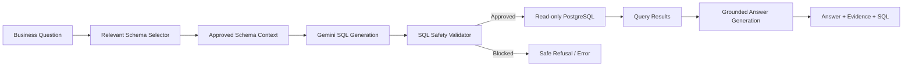
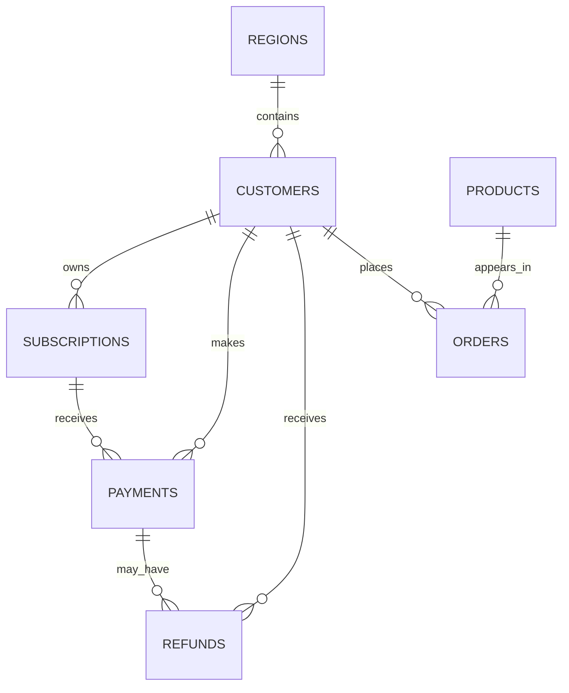
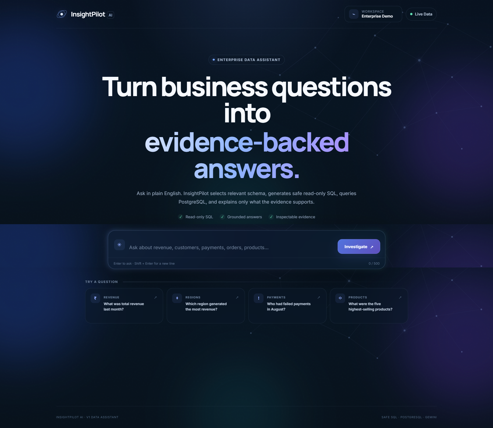
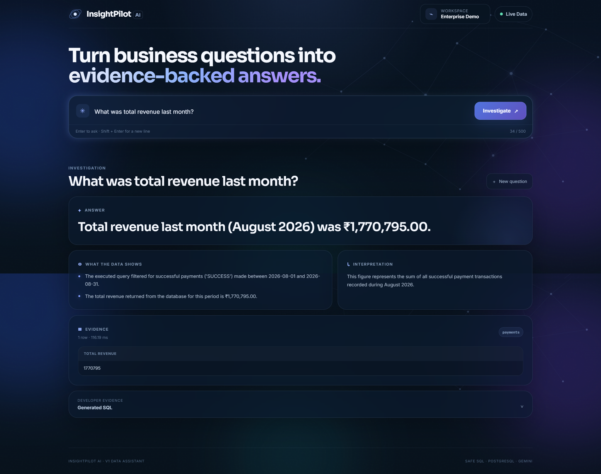
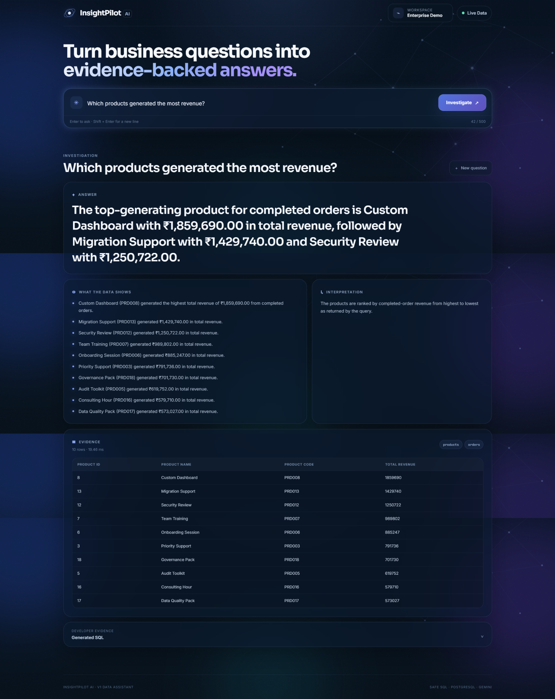
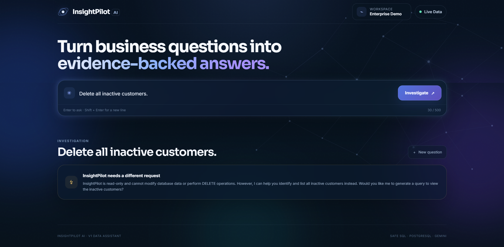
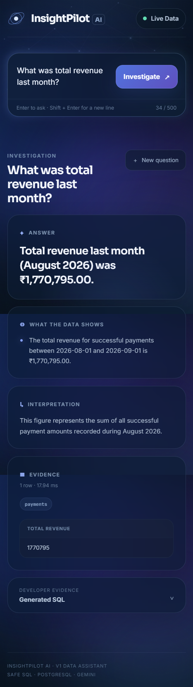

<div align="center">

# InsightPilot AI

### Enterprise Data Investigation & Analytics Agent

**Ask business questions in natural language. Generate safe SQL. Query PostgreSQL. Return grounded, evidence-backed answers.**

[](#project-status)
[](#project-status)
[](https://www.python.org/)
[](https://fastapi.tiangolo.com/)
[](https://www.postgresql.org/)
[](https://ai.google.dev/)
[](#testing)

</div>

---

## Overview

**InsightPilot AI** is an enterprise-style analytics assistant that converts natural-language business questions into controlled, read-only PostgreSQL queries and returns grounded explanations backed by executed data.

V1 establishes the **Data Assistant Foundation**: relevant schema selection, Gemini-powered SQL generation, SQL safety validation, read-only execution, evidence-backed answer generation, and a responsive web interface.

The project follows one core rule:

> **The model may reason about the data, but it must never invent the data.**

---

## Key Capabilities

| Capability | V1 Implementation |
| --- | --- |
| Natural-language analytics | Converts business questions into SQL-backed answers |
| Relevant schema grounding | Sends only the most relevant approved tables to the model |
| LLM-assisted SQL generation | Gemini generates PostgreSQL for supported questions |
| SQL safety validation | Parses and validates SQL before execution |
| Read-only database access | Uses a restricted PostgreSQL role |
| Bounded execution | Maximum 500 rows and a 10-second statement timeout |
| Grounded answers | Explanations are generated from executed query results |
| Safe failure behavior | Unsupported, destructive, or invalid requests are refused safely |
| Responsive UI | Desktop and mobile interface with answer, evidence, and SQL states |
| Automated regression coverage | 53 tests across the V1 pipeline, safety, grounding, API, and UI |

---

## Architecture



InsightPilot does not give the LLM unrestricted database access. Generated SQL must pass the application safety layer before PostgreSQL receives it, and the database connection itself uses a restricted read-only role.

---

## Safety by Design

InsightPilot treats generated SQL as untrusted input.

### Application-level controls

- Accepts exactly one SQL statement.
- Allows only read-only `SELECT` / `WITH` query shapes.
- Blocks write, DDL, administrative, and transaction-changing operations.
- Restricts queries to approved application tables.
- Rejects unapproved schemas.
- Blocks selected PostgreSQL functions that can create side effects or unsafe server access.
- Enforces a maximum result size of **500 rows**.
- Parses and normalizes SQL with **SQLGlot** before execution.

### Database-level controls

The application connects with a dedicated PostgreSQL role:

```text
insightpilot_readonly
```

That role is configured with:

```text
SELECT-only access
default_transaction_read_only = on
statement_timeout = 10s
```

This provides defense in depth: prompt instructions, application validation, and database permissions all enforce the same read-only boundary.

---

## Relevant Schema Grounding

Rather than sending the full database schema to every LLM request, V1 uses an explicit approved schema catalogue containing business terms, column meanings, and table relationships.

The user's question is matched against that catalogue and only the most relevant tables are exposed to the SQL-generation prompt, with a maximum of **four tables**.

This reduces prompt noise, improves SQL precision, and prevents unrelated database objects from entering the generation path.

---

## Business Data Model

V1 uses seven connected business tables:



| Table | Purpose |
| --- | --- |
| `regions` | Geographic business regions |
| `customers` | Customer identity, signup date, region, and account status |
| `subscriptions` | Plan, status, lifecycle dates, and monthly pricing |
| `payments` | Payment attempts, amounts, methods, and statuses |
| `refunds` | Refund amounts, reasons, and timestamps |
| `products` | Product catalogue and pricing |
| `orders` | Product purchases, quantities, amounts, and statuses |

The repository includes deterministic synthetic data so analytics behavior can be tested against known scenarios rather than random examples.

### Synthetic dataset

| Dataset | Rows |
| --- | ---: |
| Regions | 4 |
| Products | 20 |
| Customers | 1,000 |
| Subscriptions | 1,000 |
| Payments | 5,005 |
| Refunds | 177 |
| Orders | 4,200 |

---

## Business Semantics

Important measures are explicitly defined so similar-sounding questions do not drift into inconsistent calculations.

**Revenue**  
Sum of successful `payments.amount`, unless the user explicitly asks for net or refund-adjusted revenue.

**Product revenue**  
Sum of completed `orders.order_amount`.

**Highest-selling / best-selling products**  
Ranked using completed-order `quantity`.

These definitions help keep business intent aligned with the correct measure-bearing tables.

---

## Interface

### Home



### Revenue analysis



### Product revenue



### Read-only refusal



### Mobile experience

<p align="center">
  
</p>

---

## Example Questions

```text
What was our total revenue last month?

Which region generated the highest revenue in August?

How many active Pro customers do we have?

Which customers had failed payments in August?

Which products sold the most units?

Which products generated the most revenue?
```

A destructive request such as deleting customers is refused because the system is intentionally read-only.

---

## API

| Method | Endpoint | Purpose |
| --- | --- | --- |
| `GET` | `/` | Application metadata |
| `GET` | `/ui` | InsightPilot web interface |
| `GET` | `/api/v1/health` | Application and database health |
| `POST` | `/api/v1/schema/context` | Build relevant approved schema context |
| `POST` | `/api/v1/query/validate` | Validate SQL against V1 safety rules |
| `POST` | `/api/v1/query/execute` | Execute validated read-only SQL |
| `POST` | `/api/v1/ask` | End-to-end natural-language analytics pipeline |

FastAPI interactive documentation is available at `/docs` while the application is running.

---

## Tech Stack

| Layer | Technology |
| --- | --- |
| Backend | Python, FastAPI |
| LLM | Google Gemini via `google-genai` |
| Database | PostgreSQL |
| Database access | SQLAlchemy, Psycopg |
| SQL parsing and safety | SQLGlot |
| Configuration | Pydantic Settings |
| Frontend | HTML, CSS, JavaScript, Jinja2 |
| Testing | pytest, httpx |

Pinned Python dependencies are available in [`requirements.txt`](requirements.txt).

---

## Local Setup

### Prerequisites

You need Python 3.x, PostgreSQL, Git, and a Gemini Developer API key.

### 1. Clone

```bash
git clone https://github.com/phaneendrakatakam/InsightPilot-AI.git
cd InsightPilot-AI
```

### 2. Create and activate a virtual environment

**Windows PowerShell**

```powershell
python -m venv .venv
.\.venv\Scripts\Activate.ps1
```

### 3. Install dependencies

```powershell
python -m pip install -r requirements.txt
```

### 4. Create the database

Create a PostgreSQL database named:

```text
insightpilot_db
```

Apply the SQL files under [`data/sql`](data/sql/) in this order:

```text
schema.sql
load_seed_data.sql
readonly_role.sql
```

After `readonly_role.sql`, set a local password for the `insightpilot_readonly` role.

### 5. Configure environment variables

```powershell
Copy-Item .env.example .env
```

Update `.env` locally:

```env
APP_NAME=InsightPilot AI
APP_VERSION=0.1.0

DB_HOST=localhost
DB_PORT=5432
DB_NAME=insightpilot_db
DB_USER=insightpilot_readonly
DB_PASSWORD=your_local_readonly_password

GEMINI_API_KEY=your_gemini_api_key
GEMINI_MODEL=gemini-3.7-flash
```

The real `.env` file is intentionally ignored by Git.

### 6. Run

```powershell
python -m uvicorn app.main:app --reload
```

Open:

```text
http://127.0.0.1:8000/ui
```

---

## Testing

Run the automated suite:

```powershell
python -m pytest -q
```

V1 final regression:

```text
53 passed
```

Coverage includes SQL validation, schema selection, API behavior, Gemini response contracts, answer grounding, business definitions, read-only refusal behavior, and UI contracts.

A higher-level regression helper is also included:

```text
scripts/final_regression.py
```

---

## Repository Structure

```text
InsightPilot-AI/
├── app/
│   ├── api/routes/        # FastAPI endpoints
│   ├── core/              # Configuration, schema catalogue, SQL guard
│   ├── db/                # Database session and engine
│   ├── prompts/           # SQL and answer-generation prompts
│   ├── schemas/           # Request/response models
│   ├── services/          # Assistant, Gemini, query and schema services
│   ├── static/            # CSS, JavaScript and visual assets
│   ├── templates/         # Web interface
│   ├── main.py
│   └── ui.py
├── data/
│   ├── sql/               # Schema, seed loading, role and validation SQL
│   └── synthetic/         # Deterministic synthetic business dataset
├── docs/V1/screenshots/   # V1 product screenshots
├── scripts/               # Regression tooling
├── tests/                 # Automated test suite
├── .env.example
├── .gitignore
├── pytest.ini
└── requirements.txt
```

---

## Project Status

**Current milestone:** V1 — Data Assistant Foundation  
**Application version:** `0.1.0`  
**Stable release target:** `v1.0.0`

V1 is feature-complete and has passed the final automated regression gate.

```text
V1 — Data Assistant Foundation      ✅ Complete
V2 — Investigation Agent            ⏳ Next
V3 — Enterprise Data Copilot        ⏳ Planned
```

V2 will move beyond single-question analytics into multi-step investigations that combine multiple pieces of evidence—for example, explaining a month-over-month revenue decline by examining revenue movement, payment failures, refunds, cancellations, and regional performance together.

---

## Engineering Principles

1. **Ground answers in executed data.**
2. **Treat generated SQL as untrusted input.**
3. **Expose only the schema context required for the question.**
4. **Prefer explicit business semantics over ambiguous model assumptions.**
5. **Fail safely rather than fabricate an answer.**

---

## Author

**Phaneendra Katakam**

Cloud / DevOps Engineer building toward AI Engineering and Forward Deployed Engineering through production-oriented AI projects.

GitHub: [@phaneendrakatakam](https://github.com/phaneendrakatakam)

---

<div align="center">

**InsightPilot AI — turning business questions into safe, grounded data evidence.**

</div>
