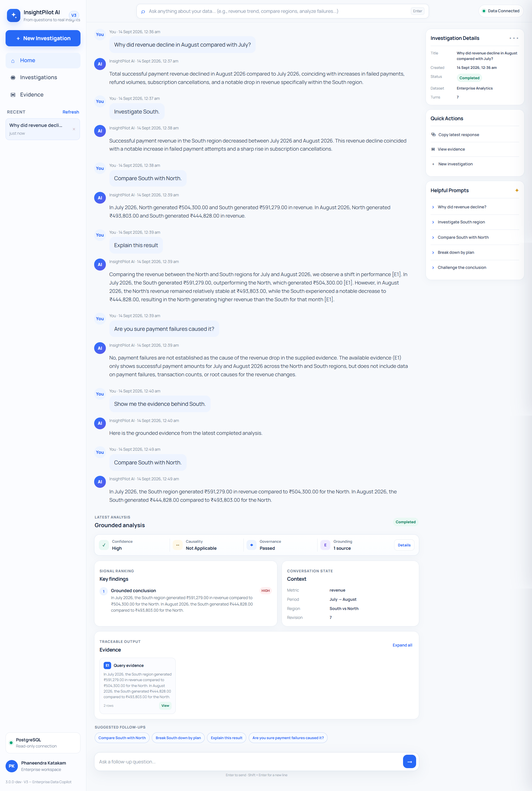
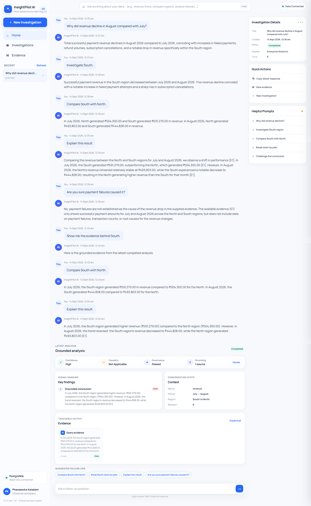
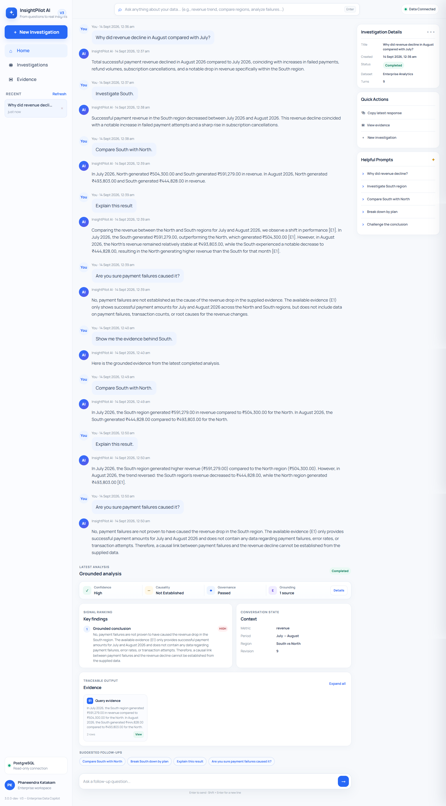
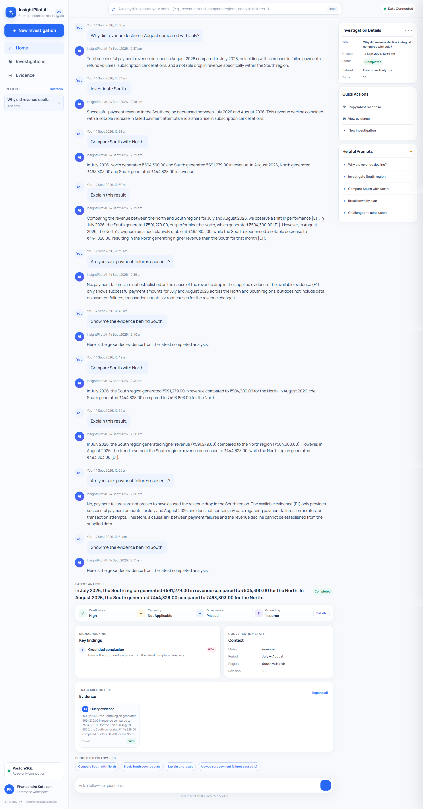
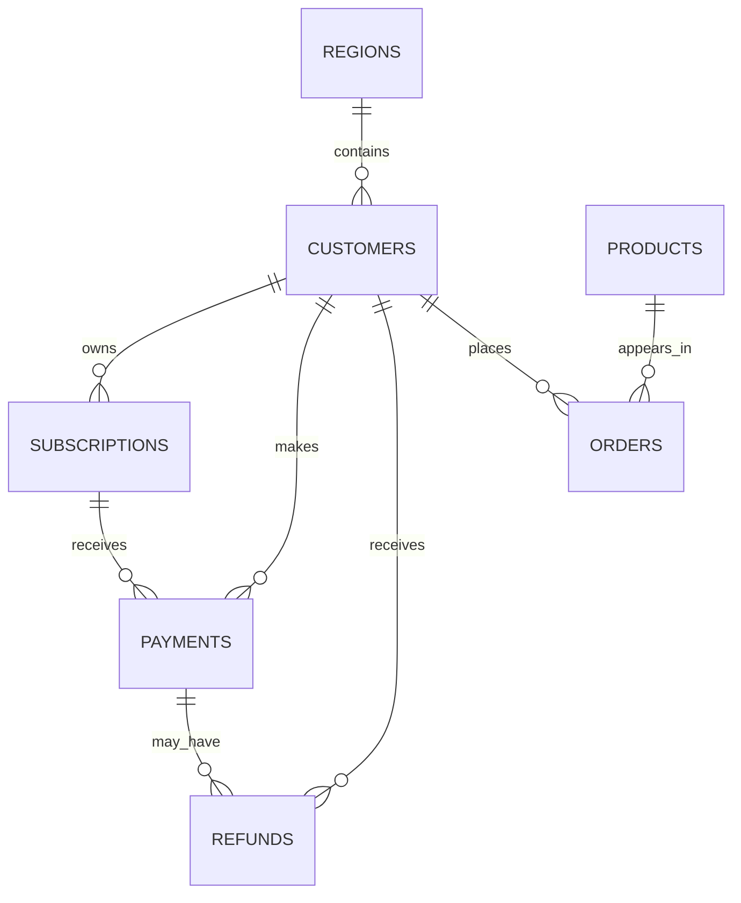

<div align="center">

# InsightPilot AI

### Enterprise Data Copilot

**A conversational analytics agent that investigates business data, executes governed SQL, remembers evidence, and explains conclusions without inventing facts.**

[](#project-status)
[](#project-status)
[](https://www.python.org/)
[](https://fastapi.tiangolo.com/)
[](https://www.postgresql.org/)
[](https://ai.google.dev/)
[](#testing)

</div>

---

## Overview

**InsightPilot AI** is an enterprise-style conversational data investigation system.

It lets a user ask business questions in natural language and progressively investigate the result through follow-up questions such as:

```text
Why did revenue decline in August compared with July?

Investigate South.

Did failures increase there too?

Compare South with North.

Explain this result.

Are you sure payment failures caused it?

Show me the evidence behind South.
```

InsightPilot does not give the LLM unrestricted database access.

Instead, the system separates:

```text
Reasoning
from
Data Authority
```

The model can:

- understand the question,
- identify analytical intent,
- plan investigations,
- generate SQL,
- interpret executed evidence,
- explain findings,
- and challenge conclusions.

But SQL must first pass application governance and then execute through a restricted read-only PostgreSQL role.

The core principle remains:

> **The model may reason about the data, but it must never invent the data.**

---

# V3 — Enterprise Data Copilot

V3 evolves InsightPilot from a question-answering analytics tool into a **stateful conversational investigation system**.

The application now maintains analytical context across turns, remembers evidence, supports comparisons and drill-downs, evaluates confidence, protects sensitive information, and explicitly separates correlation from causation.

```text
User Question
      ↓
Intent Router
      ↓
Conversation Context
      ↓
Execution Router
      ↓
┌─────────────────────────────┐
│ Simple Query                │
│ Multi-step Investigation    │
│ Evidence Reuse              │
│ Explain / Challenge         │
│ Comparison / Drill-down     │
│ Governance Block            │
└─────────────────────────────┘
      ↓
SQL Generation
      ↓
Governance + SQL Validation
      ↓
Read-only PostgreSQL
      ↓
Executed Evidence
      ↓
Evidence Memory
      ↓
KPI / Visualization Engine
      ↓
Confidence + Provenance
      ↓
Grounded Response
```

---

# Product Evolution

## V1 — Grounded Analytics

V1 introduced the safe natural-language-to-SQL foundation.

```text
Business Question
       ↓
Relevant Schema
       ↓
Generate SQL
       ↓
Validate SQL
       ↓
Read-only PostgreSQL
       ↓
Grounded Answer
```

V1 is designed for direct analytical questions such as:

```text
What was our total revenue in August?
```

---

## V2 — Investigation Agent

V2 introduced multi-step investigation.

Questions such as:

```text
Why did revenue decline in August compared with July?
```

cannot always be answered responsibly with a single query.

The V2 investigation pipeline can examine multiple signals:

```text
Revenue movement
Payment failures
Refund movement
Subscription cancellations
Regional revenue movement
```

Each step executes independently and becomes evidence for the final synthesis.

---

## V3 — Enterprise Data Copilot

V3 adds a conversational layer above V1 and V2.

It introduces:

- multi-turn analytical context,
- intent routing,
- comparison and drill-down,
- evidence memory,
- evidence reuse,
- deterministic KPIs,
- grounded charts,
- Explain & Challenge workflows,
- evidence provenance,
- confidence assessment,
- causality guardrails,
- governance and PII protection,
- query-complexity governance,
- persistent investigation history,
- telemetry and observability,
- investigation deletion,
- and a dedicated conversational interface.

---

# Product Interface

## Regional Comparison



InsightPilot preserves the active analytical context while comparing business dimensions.

For example:

```text
Metric: revenue
Period: July → August
Region: South vs North
```

---

## Explain the Result



Explanation requests operate on the active evidence instead of silently rewriting the analytical context.

---

## Challenge a Causal Claim



InsightPilot distinguishes:

```text
association
from
causation
```

If the available evidence does not establish a causal relationship, the application explicitly reports:

```text
Causality: Not Established
```

rather than overstating the conclusion.

---

## Evidence & Provenance



Evidence can be inspected without rerunning the original query.

The trust layer exposes:

- confidence,
- causality state,
- governance state,
- grounding count,
- evidence references,
- source route,
- referenced tables,
- row count,
- SQL fingerprint,
- query duration,
- and trace metadata.

---

# Conversational Context

V3 maintains an analytical context for each investigation.

Context can include:

```text
Metric
Region
Comparison regions
Subscription plan
Comparison plans
Primary period
Comparison period
Drill-down dimension
```

This allows follow-ups such as:

```text
Investigate South.
```

followed by:

```text
Compare South with North.
```

without requiring the user to repeat the entire original question.

Meta-reasoning turns such as:

```text
Explain this result.
Are you sure payment failures caused it?
Show me the evidence.
```

inspect the current analysis without silently changing the active metric, region, period, or comparison.

---

# Intent Routing

Each conversational turn is classified into an analytical intent.

Supported intents include:

```text
simple_query
investigation
follow_up
comparison
drill_down
explanation
challenge
evidence_request
```

The execution router then decides whether to:

- execute the V1 query pipeline,
- execute the V2 investigation pipeline,
- reuse stored evidence,
- answer from the current evidence context,
- or block the request through governance.

---

# Evidence Memory

Executed evidence is stored as structured snapshots.

An evidence snapshot can contain:

```text
Evidence ID
Source question
Execution route
SQL
Referenced tables
Returned rows
Row count
Conclusion
Caveats
Confidence
Provenance
```

This allows later questions such as:

```text
Show me the evidence behind South.
```

to reuse the already executed result instead of generating unnecessary SQL again.

Evidence reuse improves:

- consistency,
- latency,
- explainability,
- and traceability.

---

# Deterministic KPIs

Important numerical outputs are derived from executed rows rather than generated by the language model.

Examples include:

```text
Current value
Previous value
Absolute change
Percentage change
Period
Metric
```

This keeps numerical summaries tied to database evidence.

---

# Grounded Visualizations

V3 can convert executed evidence into chart specifications.

Supported chart behavior includes:

- line charts for time-series movement,
- bar charts for categorical comparisons,
- readable period labels,
- comparison labels containing both dimension and period,
- and evidence linkage between chart and source result.

Charts are never created from invented values.

---

# Explain & Challenge

V3 supports analytical reasoning over previously executed evidence.

### Explain

```text
Explain this result.
```

asks InsightPilot to interpret the active evidence.

### Challenge

```text
Are you sure payment failures caused the decline?
```

asks the system to evaluate whether the available evidence actually supports that claim.

The response must distinguish between:

```text
not established
association only
contribution supported
not applicable
```

The system must not infer that data is absent from the entire database merely because a particular evidence snapshot does not contain that measure.

---

# Confidence

InsightPilot uses qualitative confidence levels:

```text
High
Medium
Low
```

Confidence is based on the evidence available to the current analysis.

The system deliberately avoids fabricated numerical confidence percentages.

Confidence output can include:

```text
Level
Rationale
Evidence IDs
Limitations
Causality state
Causality note
```

---

# Evidence Provenance

Each grounded result can include provenance metadata.

Examples:

```text
Evidence ID
Source route
Source question
Referenced tables
Row count
SQL fingerprint
Query duration
Grounding type
```

This makes it possible to inspect where a conclusion came from without exposing hidden reasoning.

---

# Governance

V3 adds governance before and after SQL execution.

## Request Governance

Requests for direct customer identity exports can be blocked before SQL generation.

Examples include requests for:

```text
customer names
customer codes
email addresses
phone numbers
PII exports
```

Users can instead request aggregate or pseudonymized analysis.

---

## PII Protection

Sensitive values returned from analytical SQL are masked or pseudonymized before being exposed to the reasoning layer or UI.

Examples:

```text
customer_name → Customer-<stable token>
customer_code → Code-<stable token>
email → [MASKED]
phone → [MASKED]
```

The underlying analytical distinctness can still be preserved where appropriate.

---

# SQL Safety

Generated SQL is always treated as untrusted input.

Only approved read-only query shapes are allowed.

The SQL validation layer enforces:

- `SELECT` / `WITH` only,
- no writes,
- no DDL,
- no administrative SQL,
- approved application tables only,
- approved schema scope,
- blocked unsafe PostgreSQL functions,
- maximum result rows,
- maximum joins,
- maximum CTEs,
- maximum subqueries,
- maximum set operations.

Current limits include:

```text
Maximum result rows: 500
Maximum joins: 10
Maximum CTEs: 8
Maximum subqueries: 10
Maximum set operations: 6
```

---

# Database-Level Safety

InsightPilot connects through a restricted PostgreSQL role:

```text
insightpilot_readonly
```

The database role uses:

```text
SELECT-only permissions
default_transaction_read_only = on
statement_timeout = 10s
```

The application therefore has multiple safety boundaries:

```text
User Request Governance
        ↓
Prompt Constraints
        ↓
SQL Validation
        ↓
Query Complexity Limits
        ↓
Approved Table Scope
        ↓
Read-only PostgreSQL Credentials
```

---

# Grounding & Anti-Fabrication

InsightPilot does not treat LLM output as database truth.

A supported answer must ultimately originate from executed evidence.

The application does not:

- fabricate rows,
- invent query results,
- claim blocked queries succeeded,
- convert missing evidence into negative evidence,
- invent unsupported metrics,
- silently overstate causality,
- or claim the whole dataset lacks information merely because one evidence snapshot does not contain it.

When evidence is insufficient, InsightPilot should say so.

---

# Persistent Investigation History

V3 persists investigation state locally using SQLite.

The runtime store can retain:

```text
Conversation sessions
Messages
Conversation context
Evidence snapshots
Telemetry events
```

This means investigation history can survive application restarts.

The local runtime database is intentionally excluded from Git.

Users can also delete investigations through the product interface.

Deleting an investigation removes its associated:

- conversation,
- context,
- evidence,
- and telemetry records.

---

# Observability

V3 records structured telemetry for conversational turns.

Telemetry can include:

```text
Trace ID
Session ID
Intent
Execution route
Status
Total duration
SQL query count
Database query time
Evidence count
Evidence reuse
Retry count
Governance status
Error class
```

The observability endpoint is intended for internal inspection and is not exposed as a normal product navigation item.

---

# Business Semantics

InsightPilot uses explicit business definitions to reduce metric ambiguity.

## Revenue

```text
SUM(payments.amount)
WHERE payment_status = 'SUCCESS'
```

unless the user explicitly requests net or refund-adjusted revenue.

## Product Revenue

```text
SUM(orders.order_amount)
```

for completed orders.

## Highest-Selling Products

Ranked by:

```text
SUM(orders.quantity)
```

for completed orders.

## Subscription Cancellations

Cancellation analysis uses subscriptions with:

```text
subscription_status = 'CANCELLED'
```

within the requested period.

## Refunds

Refunds are treated as a separate adverse business signal unless the user explicitly requests net revenue.

## Failed Payments

Failed-payment amounts represent attempted transaction values.

They must not automatically be described as guaranteed lost revenue.

---

# Business Data Model

InsightPilot uses seven connected business datasets.



| Table | Purpose |
| --- | --- |
| `regions` | Geographic business regions |
| `customers` | Customer accounts and regional mapping |
| `subscriptions` | Subscription plans and lifecycle information |
| `payments` | Payment attempts, amounts, methods and status |
| `refunds` | Refund transactions |
| `products` | Product catalogue and pricing |
| `orders` | Product purchases and quantities |

---

# Synthetic Dataset

The repository includes deterministic synthetic business data.

| Dataset | Rows |
| --- | ---: |
| Regions | 4 |
| Products | 20 |
| Customers | 1,000 |
| Subscriptions | 1,000 |
| Payments | 5,005 |
| Refunds | 177 |
| Orders | 4,200 |

The dataset intentionally contains analytical patterns that can be discovered through multi-step investigation.

---

# Example Investigation

A representative V3 conversation:

```text
User:
Why did revenue decline in August compared with July?

InsightPilot:
Runs a multi-step investigation across revenue,
payment failures, refunds, cancellations and regions.

User:
Investigate South.

InsightPilot:
Drills into South while preserving the original metric and period.

User:
Compare South with North.

InsightPilot:
Builds a grounded regional comparison.

User:
Explain this result.

InsightPilot:
Explains the comparison using the active evidence.

User:
Are you sure payment failures caused it?

InsightPilot:
Challenges the causal claim and reports whether causality is established.

User:
Show me the evidence behind South.

InsightPilot:
Returns the relevant stored evidence and provenance.
```

---

# API

V1 and V2 remain available underneath the V3 conversational layer.

## Main Product

| Method | Endpoint | Purpose |
| --- | --- | --- |
| `GET` | `/` | Main InsightPilot V3 interface |
| `GET` | `/ui` | Backward-compatible UI alias |

## V1

| Method | Endpoint | Purpose |
| --- | --- | --- |
| `GET` | `/api/v1/health` | Application/database health |
| `POST` | `/api/v1/schema/context` | Relevant schema selection |
| `POST` | `/api/v1/query/validate` | Validate SQL |
| `POST` | `/api/v1/query/execute` | Execute approved read-only SQL |
| `POST` | `/api/v1/ask` | Single-question analytics pipeline |

## V2

| Method | Endpoint | Purpose |
| --- | --- | --- |
| `POST` | `/api/v2/investigate` | Multi-step investigation pipeline |

## V3

| Method | Endpoint | Purpose |
| --- | --- | --- |
| `POST` | `/api/v3/sessions` | Create investigation session |
| `GET` | `/api/v3/sessions` | List recent investigations |
| `GET` | `/api/v3/sessions/{session_id}` | Retrieve a session |
| `DELETE` | `/api/v3/sessions/{session_id}` | Delete an investigation |
| `GET` | `/api/v3/sessions/{session_id}/evidence` | Retrieve stored evidence |
| `POST` | `/api/v3/sessions/{session_id}/messages` | Add a user message |
| `POST` | `/api/v3/sessions/{session_id}/turns` | Execute conversational turn |
| `POST` | `/api/v3/sessions/{session_id}/context/reset` | Reset analytical context |

---

# Tech Stack

| Layer | Technology |
| --- | --- |
| Backend | Python, FastAPI |
| LLM | Google Gemini |
| Gemini SDK | `google-genai` |
| Primary database | PostgreSQL |
| Runtime persistence | SQLite |
| Database access | SQLAlchemy, Psycopg |
| SQL parsing / validation | SQLGlot |
| Data contracts | Pydantic |
| Configuration | Pydantic Settings |
| Frontend | HTML, CSS, JavaScript |
| Templates | Jinja2 |
| Visualization | Chart.js-compatible chart specs |
| Testing | pytest, httpx |

---

# Repository Structure

```text
InsightPilot-AI/
├── app/
│   ├── api/
│   │   └── routes/
│   │       ├── ask.py
│   │       ├── conversation.py
│   │       ├── health.py
│   │       ├── investigate.py
│   │       ├── query.py
│   │       └── schema.py
│   │
│   ├── core/
│   │   ├── config.py
│   │   ├── governance.py
│   │   ├── schema_catalog.py
│   │   ├── sql_guard.py
│   │   └── version.py
│   │
│   ├── db/
│   │   └── session.py
│   │
│   ├── prompts/
│   │   ├── answer_generation.py
│   │   ├── evidence_reasoning.py
│   │   ├── investigation_planning.py
│   │   ├── investigation_synthesis.py
│   │   └── sql_generation.py
│   │
│   ├── schemas/
│   │   ├── analytics.py
│   │   ├── assistant.py
│   │   ├── conversation.py
│   │   ├── investigation.py
│   │   ├── query.py
│   │   └── schema_context.py
│   │
│   ├── services/
│   │   ├── confidence_engine.py
│   │   ├── context_manager.py
│   │   ├── copilot_service.py
│   │   ├── evidence_followup.py
│   │   ├── evidence_memory.py
│   │   ├── execution_router.py
│   │   ├── intent_router.py
│   │   ├── investigation_executor.py
│   │   ├── investigation_planner.py
│   │   ├── investigation_service.py
│   │   ├── investigation_synthesizer.py
│   │   ├── kpi_engine.py
│   │   ├── observability.py
│   │   ├── provenance.py
│   │   ├── query_executor.py
│   │   ├── runtime_store.py
│   │   ├── session_store.py
│   │   └── visualization_engine.py
│   │
│   ├── static/
│   │   ├── css/
│   │   └── js/
│   │
│   ├── templates/
│   ├── main.py
│   └── ui.py
│
├── data/
│   ├── sql/
│   └── synthetic/
│
├── docs/
│   ├── V1/
│   ├── V2/
│   └── V3/
│
├── runtime/
│   └── local runtime database
│       (Git ignored)
│
├── scripts/
├── tests/
├── .env.example
├── .gitignore
├── pytest.ini
├── README.md
└── requirements.txt
```

---

# Local Setup

## Prerequisites

You need:

```text
Python 3.x
PostgreSQL
Git
Gemini Developer API key
```

---

## 1. Clone

```bash
git clone https://github.com/phaneendrakatakam/InsightPilot-AI.git
cd InsightPilot-AI
```

---

## 2. Create a Virtual Environment

### Windows PowerShell

```powershell
python -m venv .venv
.\.venv\Scripts\Activate.ps1
```

---

## 3. Install Dependencies

```powershell
pip install -r requirements.txt
```

---

## 4. Configure Environment Variables

Copy:

```text
.env.example
```

to:

```text
.env
```

Then configure your local values:

```env
APP_NAME=InsightPilot AI
APP_VERSION=3.0.0

DB_HOST=localhost
DB_PORT=5432
DB_NAME=insightpilot_db
DB_USER=insightpilot_readonly
DB_PASSWORD=your_local_readonly_password

GEMINI_API_KEY=your_gemini_api_key
GEMINI_MODEL=gemini-3.7-flash
```

Never commit the real `.env` file.

---

## 5. Prepare PostgreSQL

Database setup assets are available under:

```text
data/sql/
```

including:

```text
schema.sql
load_seed_data.sql
readonly_role.sql
validation_queries.sql
```

Synthetic data is available under:

```text
data/synthetic/
```

---

## 6. Run InsightPilot

```powershell
python -m uvicorn app.main:app --reload
```

Open:

```text
http://127.0.0.1:8000/
```

This is the primary product interface.

---

# Testing

Run the complete suite with:

```powershell
python -m pytest -q
```

V3 release regression:

```text
158 passed
```

The suite covers areas including:

- SQL safety,
- grounding,
- business definitions,
- investigation planning,
- evidence synthesis,
- conversational context,
- intent routing,
- execution routing,
- evidence memory,
- evidence reuse,
- KPIs,
- comparison and drill-down,
- Explain & Challenge,
- provenance,
- confidence,
- causality guardrails,
- governance,
- PII masking,
- persistent history,
- deletion,
- visualization,
- and UI behavior.

---

# Project Status

```text
Version: 3.0.0
Phase: V3 — Enterprise Data Copilot
Status: Release-ready
Regression: 158 tests passed
```

V3 functionality is considered feature-complete for this release.

The focus of the release is not autonomous database access.

It is **controlled, inspectable, evidence-grounded enterprise analytics**.

---

# Design Principles

InsightPilot is built around a few deliberate constraints:

```text
Evidence before explanation.
Validation before execution.
Read-only by default.
Context without silent mutation.
Correlation is not causation.
Sensitive data should not leak.
Missing evidence is not negative evidence.
The LLM proposes — the system decides.
```

---

<div align="center">

### InsightPilot AI v3.0.0

**Enterprise Data Copilot**

From business questions to governed SQL, persistent evidence, explainable investigations, and trustworthy analytical conversations.

</div>
